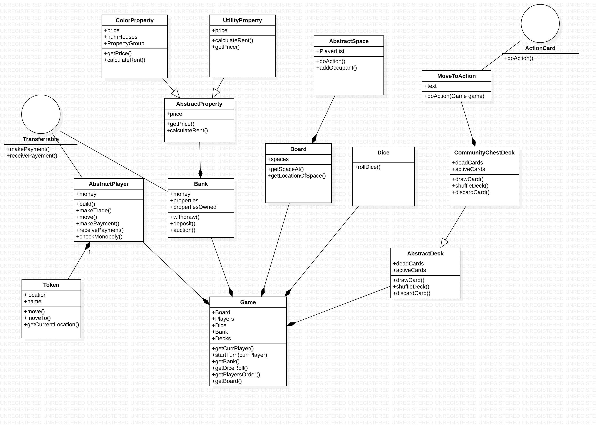

### Introduction

* Problem we are solving - allow users to play multiple variations of monopoly with different spaces, 
different rules, and different board formations.

* Primary Design Goal - write code that is flexible - design it so that it is easy to add new game types 
with different rules, spaces, boards, and GUIs.

* Primary Architecture of Design - overriding/ruling class will be Game because it will hold all of the 
information necessary for the game to progress.  However, the Game class itself does not perform any 
real actions.  Instead, the Space classes will shoulder the majority of the real workload, initializing 
every action that is needed on every turn based on the type of Space it is. Each space will execute the 
action associated with itself.  This will follow the Command Design Pattern.  Each space will be able to 
execute its actions by getting the required objects and methods from the overall Game class and sending 
these to the player that landed on said space.
    * Our design will be extensible in the sense that new game types and spaces for these game types can 
    be added simply by adding new concrete space classes that will implement the required actions thereby 
    extending our program without having to modify the existing code.  
    * Furthermore, we will use configuration files to select between different game types, which will 
    in turn initialize the spaces used for this specific game type.  Changing the game in the configuration 
    file will therefore enable us to invoke different rules and spaces for different boards and games.

* Overall, our program will separate all of the roles of monopoly as well as well possible, writing 
small classes.  Each class will interact with one another as minimally as possible, while the overriding 
Game class will foster the connections between all of the other working classes.  Our front end (view) 
will be completely separate from the functional gameplay classes that will be found in the back end of our 
program.  Our goal is to create a modular program that can easily be used to play multiple forms of monopoly.    

### Overview

We plan on having 3 packages: model, view, and controller. 

In our controller package we will have the following classes: 
* DataReader.java
* SetUp.java
* Game.java

In our view package we will have the following classes:
* SceneSetup.java
* Main.java
* PlayerActionPanel.java
* BoardDisplay.java
* PropertyDisplay.java

In our model package we will have the following classes:
* Space.java
* Player.java
* Token.java
* Bank.java
* Board.java
* Dice.java
* Property.java
* ActionCards.java
* Deck.java

Game.java - responsible for holding all objects, players, decks, etc. that are relevant to gameplay. 
This class is responsible for combining all of our objects and making them interact.

* Players
* Bank
* Board
    * Spaces
* The game will know who is currently playing
* The game will know the dice history to see how many doubles have been rolled
* Knows which player sits next to who
* Action Card Decks
    * Community Chest Deck (draw = pop; replace to discard pile)
        * Card.doAction(Game this)
    * Chance Deck (draw = pop; replace to discard pile)
        * Card.doAction(Game this)
    * Free Parking Money
* Space.java - The spaces will have a doAction method, which will indicate that action should 
be performed if this space is landed on.
    * Has an arraylist of players called Occupied
* Player.java - Players will have methods that players should be capable of doing. They will have 
makeTrade(), makePayment(), move(), buyThing(), receivePayment(), handleTrade(), build() etc. 
(used to accept or reject a trade)
    * Player knows current location of its token
    * Player has all of its assets and cards
    * Money 
    * Has a Token 
    * ifMonopoly()
        * Checks player’s assets and then builds if it has a monopoly (if having a monopoly is necessary for building)
* Token.java - a small utility class which represents what the player moves on the board
    * move()
        * Returns a location
    * Name
    * moveTo()
* Bank.java - responsible for managing assets (properties, buildings, etc.) and money
    * How much money is in the bank
        * withdraw()
        * deposit()
    * Properties owned 
        * {property : owner}
    * Properties left
    * auction()
* Board.java - knows the spaces (knows which spaces are next to each other)
    * Has a spaces grid
    * getSpaceAt()
    * getLocationOf()
* Dice.java - class that represents the number of dice, the number of sides on each dice, 
and the values on each side of each dice
    * roll() - method to roll the dice
* AbstractProperty.java - an abstract representation of a property that will have specific 
subclasses such as listed below.
    * ResidentialProperty.java
        * Color
        * Price
        * Rent
        * Rent w/ monopoly
        * Cost of house
        * Cost of hotel
        * Rent w/ 1-4 houses
        * Rent w/hotel
        * mortgage 
        * Int housesBuilt
        * Int hotelsBuilt
    * UtilityProperty.java
        * Price
        * ent with 1 owned
        * Rent with 2 owned…
    * Railroad.java
        * Price
        * Rent with 1-4 owned
*  transaction interface - defines standard methods of payment
    * Player implements Transaction
    * Bank implements Transaction
* SetUp.java - responsible for reading in all the data from the config files and constructing 
the board, the decks, etc.
* ActionCards.java - will be an abstract class that has subclasses representing specific actions 
defined in a game. Each type of action will have a specific message, but the functionality of 
their doAction method will be the same.
    * WinMoney.java
    * LoseMoney.java
    * GoToJail.java
    * GetOutOfJail.java
    * MoveTo().java
    * LoseTurn().java
    * RollAgain().java
* Deck.java - a class that represents each different card deck in the game.
    * draw()
    * shuffle()
    * discard()

Here is a UML diagram:

### User interface

* Splash screen 1 will be the first thing that the user sees. They will choose what game type to 
play by clicking one of the buttons listed.
* Splash screen 2 will allow users to add player by choosing a token from a drop down, 
entering a name, and choosing the player type (human, computer, etc.) from a drop down. The user 
will have the option to edit the player list and choose who goes first with a toggle button. 
A button for instructions will also be on the screen. Start the game by clicking the start game button.
* Things the user interacts with once the game starts:
    * Tab to see general game stats - time elapsed, properties remaining, rules
    * Button to roll dice
    * After landing on a space, a pop up will alert the user of the action performed by the space
        * Property: If not owned by another player, display property details, click button to 
        buy or send to auction. If owned, click ok to pay rent.
        * Things that the user has only one option (taxes, community card, chance card, jail, GO): 
        click ok button.
    * Button to propose a trade will bring up a pop up window.
        * Choose player to trade with with drop down
        * Choose properties you would like to trade from drop downs
        * Click trade button to send request to other player
        * Other player clicks accept or decline trade button
    * Property management button brings up a pop up window.
        * Choose action (build or sell) from tabs.
        * Choose which property you would like to build on and choose number of houses to build with 
        increment buttons. Displays price info. Click confirm button to buy.
        * Choose which property you would like to sell from drop down and click confirm button.
    * Button to end turn
* UI design goals - make it flexible to create the UI for new game types and create reusable components 
to minimize repetition.
* How a game is represented to the designer and what support is provided to make it easy to create a game:
    * The layout of the GUI is mostly similar between game types, with the left side of the screen 
    displaying the board and the right side displaying the gameplay controls.
    * We will create an abstract board display class which each game type will extend.
    * We will create an abstract space display class extended by:
        * top/bottom space display
        * side space display
        * top/bottom property space
        * side property space
        * corner space display
    * We will create an abstract gameplay controls class which each game type will extend.
    * We will create an abstract Layout class that has boxes for the board, the gameplay controls, 
    and player info/options.
    * Each game type will extend the Layout class and add a board display, gameplay controls, 
    and player info
* Erroneous situations:
    * Our design minimizes places for user error because the user interacts with the game only through 
    buttons. The only place where the user could leave the name TextField empty. In this case, we will 
    choose a name for them :).

### Design details

The overall program will be divided into 3 modules: Model, View, and Controller.

* Space Class/Interface
    * Space can either be a class or an interface. As of now, there is only one abstract method 
    doAction(). When a player lands on a specific type of space (ResidentialSpace implements/extends 
    Space is an example), the doAction() method is called. So, for example, if the class that 
    implements/extends space is a ResidentialSpace, then the doAction method will either make 
    the player who landed on the property pay rent to the owner, let the player buy the property, 
    or do whatever other actions are possible.
    * This class/interface does not really collaborate with other modules, but ensures that certain 
    modules implement a doAction method, which the game will call whenever a token lands on any 
    space. If the space does not have a particular action associated with it, the doAction method 
    will be empty.
* Board
    * The Board class is responsible for indexing and storing a collection of all the spaces 
    on the board. When the Game rolls the dice, the Game will use the board to find which space 
    corresponds to the new index.
    * This will be accomplished by the following methods 
        * getSpaceAt(int)
            * Returns a Space
        * getLocationOf(Space)
            * Returns an int
    * The board may or may not know where the tokens are based on implementation
    * The board will essentially interact with our Game class, which is in our controllers package.
    * The Board will rely on resources from our XML file. The Board will read in all of the types of 
    spaces and their indices and put them in a data structure. This data structure could be a map or 
    an ArrayList
    * This fits with our key design goals because we only want our Game class to be the intermediary 
    between all the players, dice, bank, etc. The game class should not include much functionality 
    of how things actually work or function. By having a board class, although it is a simple in 
    implementation, makes the code easier to understand and allows for more flexibility by possibly 
    adding methods/features to the board if necessary or extending the board class to account for 
    different types of boards.
* Property
    * The property class will be an abstract class that will define basic components of a property 
    (price, original rent, etc.) There will be subclasses of property, such as ColorProperty, 
    UtilityProperty, RailroadProperty, etc. These subclasses will have different behaviors. For 
    example, a ColorProperty will know the other properties in its color group, will know how many 
    houses/hotels it has on it, will know how much rent a user pays if landing on the property. 
    A RailroadProperty, however, will not have a number of houses since it does not apply to this 
    type of property. A UtilityProperty will define rent based on what the user rolls etc. 
    Basically each property type will know all the specific information it needs to know (it 
    will know all the information on its physical card in real monopoly).
    * The resources these classes will use will also be from the XML file. We will read information 
    in about each type of property and then set appropriate values based on which type of property 
    it is.
    * This design choice fits in with our idea of separating spaces from properties. While there 
    are many types of residential spaces that can have houses, there doAction method for all of 
    them is the same. Therefore, we created a separate hierarchy to contain all the information 
    that would be on a property card in actual monopoly.
* Transactions interface:
    * A Transactions interface It will have abstract methods that allow entities to spend money and 
    receive money such as makePayment() and receivePayment(). makePayment will take a parameter 
    stating who the payment is going to, and both will have a parameter stating the amount of the 
    payment. This will be crucial for parts of the spec like collecting $200 when passing go, 
    buying/selling/auctioning properties, paying rent, mortgaging, implementing chance/community 
    cards that involve paying or earning money, buying one’s way out of jail. For instance, when a 
    player passes go, the bank will call makePayment and specify to which player and that the player 
    recieves 200 dollars. Within this method, the Players’ receive payment will likely be called as well.
    * Essentially, Transactions will be implemented by classes such as Bank and Player, and it 
    will allow them to augment or decrease their funds when performing the several actions stated above.
    * Transactions is general enough that if there are other game types which handle making 
    payments or receiving payments in a more peculiar way (say a player is taxed when receiving 
    funds), it allows the class implementing it to simply specify that within the function.
    * This fits in with our goals because it eliminates the redundancy of having very similarly 
    named functions in player and bank that increase and decrease their funds. It consolidates 
    a key portion of the game, which is making transactions, into an interface that can be 
    modified to fit the necessary rules.
* Bank Class
    * As stated above, the bank class will implement the Transactions interface, and will use 
    the make and receive Payment methods in order to properly update its total funds when it 
    receives money from players or distributes money. This allows us to change the rules, say 
    if we want the bank to have unlimited funds, versus having a limited amount.
    * The bank also keeps track of all properties. It keeps a map of all owned properties that 
    maps properties to the player that owns them and also keeps a data structure of all unowned 
    properties. It also sells properties and auctions them off, utilizing sellProperty() (which 
    handles a normal case when someone lands on a property and then buys it) and AuctionProperty() 
    (which prompts all players to bid on the property) and allow
    * Thus, the bank must collaborate with the Player and Properties modules in order to allow for 
    these transactions to occur and to keep track of all properties and who owns them.
    * The bank is very concrete. By keeping the bank method fairly general and not dependent on 
    specific types of properties or currencies, it allows for compatibility with new game types 
    and rules. All monopolies deal with currencies and properties of some form.
* Player class
    * Players have member variables that keep track of their assets (whether that be properties, 
    utilities, brands, experiences etc), funds (which is the total $ amount a player has, works 
    for electronic ), and actionCards (get out of jail free, etc). Furthermore, Players will have a 
    method that allows them to makeTrades with their assets and specify what assets they are giving 
    up or receiving. Also, Players will be able to check if they have a monopoly with their assets 
    with a checkMonopoly method that takes in a property and then sees if the player holds all types 
    of that property. This is how players, banks, and properties all interact to determine prices 
    for transactions.
    * As mentioned before, Players will implement the Transaction interface, allowing for making and 
    receiving payments, highlighted above.
    * Furthermore, a player will be represented by a token, which will be fleshed out in more detail 
    in the next section.
    * Again, we believe that this class is concrete and general enough that it can fit any type of 
    monopoly game, as it isn’t reliant on any specific type of currency or assets, it is generalized.
* Token
    * In order to not make the Player class too crowded, we decided to also have a token class 
    which deals with a players placement on the board.
    * This class has a move() method which takes in an integer and advances the player that many 
    spaces ahead of their current space, a currLocation method that returns where the player is 
    on the board, and a moveTo() location that allows for players to jump to different locations, 
    like going to jail. These will mainly interact with the Space and Board classes, by calling 
    the method that gets the space at a specific index on the board and then updating the 
    currLocation to that index.
    * We felt that this separated our code and distributed it more evenly so Player didn’t have 
    too many different functions. The token and Player are still connected, as the Player keeps 
    an instance of its Token. Token can be extended to different games and rules because it is a 
    very small, specific class, that doesn’t rely on the board shape or types of spaces, but 
    rather keeps things simple and in terms of indices on the board.
* Dice Class
    * Dice class is a small class that really only has one method, roll(int sides).
    * The Dice class will also have an instance variable that is int sides to represent the number 
    of sides on the dice.  This class is referenced by Game.  When a player “clicks” the roll dice 
    button, Game will then call dice.roll() and get the number that is randomly generated by the 
    Dice.roll() method.  
* Game Class
    * The Game class is the overriding class that holds all of the objects and information that are 
    necessary to the gameplay.  This class does not perform many specific gameplay actions but helps 
    to connect other modules to one another. For example, as described above, each space initializes 
    the action that is to be undertaken for the given space.  Once the space initializes this action, 
    it must go to the Game class in order to get the player, bank, properties, or whatever other 
    objects are necessary to complete said action.
    * The objects that will be held by the Game class are:
        * Players (in their turn order)
        * Bank (which has funds and properties)
        * Board (which has spaces)
        * Current Turn (player that is currently up)
        * Dice
        * Action Cards Decks(Chance/Community Chest)
    * During a turn, the Game class will call Dice.roll() in order to get the roll, and proceeds 
    to implement its handleRoll() method, which on a normal roll will call Player.token.move() 
    to update the player’s location.  Allowing Game to handleRoll() enables the game to check 
    if the roll is a double and therefore allow the current player to remain the current player, 
    as well as to keep track of the number of doubles that have been rolled in order to determine 
    whether or not the player must go to jail.  This will also enable us to more easily handle the 
    “speed dice” implementation in the future.  Then, since the game holds the board as well, it 
    will be able to find the Space on the board and then call this space’s Space.doAction() method.  
    Overall, the Game class essentially oversees the actions and progression of the game, keeping 
    track of who’s turn it is as well.
    * We believe that Game will live in our Controller package and manage the connection between 
    the front end and back end, as well as the connection between various back end classes with 
    one another.
    * Finally, Game call the SetUp class which will initialize all starting values and setup the overall game.
* SetUp Class
    * Initialize game board depending on the game type found in the config file. When setting up the board, 
    it will also initialize all of the required spaces to make up the board. The setup class will then 
    return this to be held in Game.
    * Initialize all action cards and decks of these action cards depending on the type of game and 
    types of action cards associated with said game play.
    * Initialize players (live and automated) giving them the correct starting amount of money and 
    asking for their tokens, placing them at the “GO” space.
    * Finally, SetUp will create all of the properties that will exist in this game play type and 
    pass this list of unowned properties to be held by the bank.  
* Action Cards:
    * This class will be an abstract class that holds three member variables.  The first variable 
    will be a String message that is displayed to the user when he/she draws an action card.  
    The second variable will be a boolean representing whether or not the card must be played 
    right away or can be held in a player’s hand.  The third variable will be of type Deck (which 
    is another class that we will create), which specifies which deck this card is a part of 
    (such as Community Chest or Chance).  
    * The concrete subclasses of Action Cards will be determined based on categories of actions that 
    might be invoked by these cards.  For example, some such cards send players to specific spaces, 
    send them to jail, get them out of jail, gives a player more money, or forces a player to pay 
    some sort of fine.  These groupings will all have unique messages, but their doAction() methods 
    will all be the same within their grouping.  Therefore, some concrete subclasses that we know we 
    will create include:
        * WinMoney
        * LoseMoney
        * GoToJail
        * GetOutOfJail
        * MoveTo
        * LoseTurn
        * RollAgain
    * By creating subclasses based on actions, we make our program flexible to any and all new action 
    cards that might arise in different game types.  For example, if one game type also employs an action 
    card that hypothetically allows a user to steal someone’s property, one would simply have to create 
    another subclass under action cards entitled stealProperty() and implement this action card’s doAction() 
    method.
    * Furthermore, all of these cards will be sorted into decks depending on their type, as discussed above. 
    These Deck classes will handle the distribution of and discarding of said Action Cards.
* Deck
    * The Deck class will be a concrete class that holds two instance variables.  Each instance variable 
    is simply a list of action cards.  First, there is the “liveCards” variable that holds action cards 
    from which user’s draw cards upon landing on an action card space.  The second list is a “deadCards” 
    variable to which users discard their used action cards.  
    * Furthermore, the Deck class will have three methods.  First, the draw() method removes and returns the action card at the top of the “liveCards” list.  It also checks to see if the “liveCards” list is empty, and if so, calls its other method, shuffle().  Shuffle simply re-orders the “deadCards” list and sets “liveCards” equal to this newly reordered list of action cards.  Then, it resets “deadCards” to an empty list, thereby reshuffling and refilling the action cards that can be drawn by players.  Finally, the discardCard() method takes an action card as a parameter and adds it to the “deadCards” list.  This method is called after an action card has been used and its doAction() method has been completed.   

### Example games

* Monopoly City is a variation that is quite different because the game includes a variety of building 
types such as parks, water towers, wind farms, schools, prisons, sewage plants, trash dumps, and power plants. 
    * To handle the different tokens:
        * We will specify in the XML file all the type of buildings a user can build (as well as details 
        such as cost of building and effects of building).
        * Our design then incorporates this through our Property hierarchy. Each property will keep 
        track of the variety of objects that are on it. The specific property type will have a rent value that 
        is calculated based on the rules determining how these objects affect the rent of the property.
        * Having new tokens and different types of properties will be handled by the property since it will
         know its current rent.
    * Another difference is that you do not need 3 of a kind to start building.
        * This is incorporated in our XML file under the rules section. If a player will be able to 
        build under certain conditions. If those conditions are met, in this case the condition to 
        have 3 colors in a color group is not needed, then the player will be able to build.
* Another game that is different is Solarquest. This game is significantly different than the original 
for a few reasons. The first difference is the shape of the board. The board is not a square (or circle) 
but an interesting twisted shape in which the player moves from planet to planet. Another difference is 
that players can run out of fuel, and if they do, they become stranded. Some moves do not require fuel while 
some do. The third difference is that there is a laser battle that can blow an opponent up.
    * To handle the shape of the board:
        * This is why we have a board class. The specific function of the board class is to index the 
        board and specify which spots are next to each other. This class will have methods that convert 
        an index to an actual space and vis-versa. 
        * For fuel:
            * In our XML, we will have rules about movement. In the rules about movement, we will specify 
            specific rules about how much a player can move.
    * For laser battles:
        * In this game, a player can initiate a laser battle with another player if they are close enough 
        to each other. If the players are close enough, then they can have a laser battle by rolling. 
        If the player rolls doubles they damage the opponent, and if they roll double sixes they destroy 
        the opponent. This feature can be added to the players, and they will be given an option to 
        initiate a laser battle if they are close enough to someone else.
    * We could specify actions that a player can take in our XML file and parse the rules and results.
* House rules monopoly is simply modifying a lot of the rules in the original monopoly game. 
Some of these differences include a different amount of money given when passing Go, more start money, 
free parking cash, etc. There are a variety of different and small rules to implement to be able to 
play this game.
    * I think our design handles this by using the an XML file. We can specify as many tags as we want 
    that specify information, that we will have to parse accordingly. A lot of these changes, such as the 
    amount of money given when passing Go or how much money each player starts with is simply specifying 
    a value in our rules tag that indicates those values. Thus, when creating a new game, we would create 
    a new XML that includes specific tags for different rules.

### Design considerations
* Assets in Player Class:
        * Pros 
            * Players are aware of all properties they own and any holadble action cards they may own
            * Easily accessible to player, thus allows for trading between players and mortgaging/selling 
            to the bank to be easier
        * Cons
            * The bank already knows what properties are owned, it would be easy code to also make it the 
            responsibility of the bank to know what property is owned by what player
* Houses in Property Class:
    * Pros
        * Properties are responsible for knowing any and everything that could affect rent
        * Easy to implement code that checks number of houses for a given property and increases rent 
        accordingly because all in same class
    * Cons
        * Houses should be a part of assets in the player class, because they can be individually sold 
        to the bank or a player 
* CheckMonopoly(Property) in Player Class:
    * Pros
        * Player contains the properties a player owns thus it is simpler to create this method 
            inside that class because the information to answer is located there
    * Cons
        * A property could be responsible for knowing how many properties are in its color group 
            thus when it is owned with the rest of the properties that complete it this method could be 
            set to true if it were a part of the property class
* Token Class
    * Pros
        * Simplifies code, because now the Player class can be responsible for one less action
    * Cons
        * Adds a class that could be two methods in the play 
        * Applies to the player class, because a token is a representation of a player, 
        therefore it should be controlled by the player
